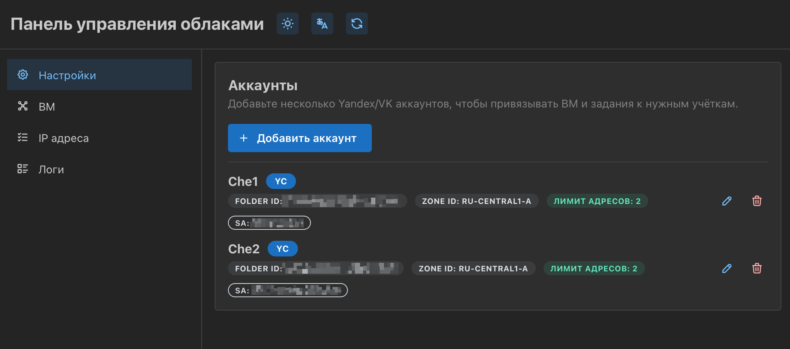
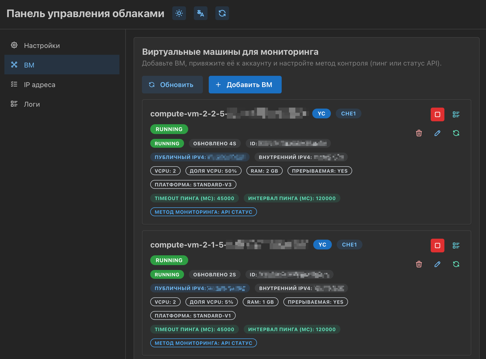
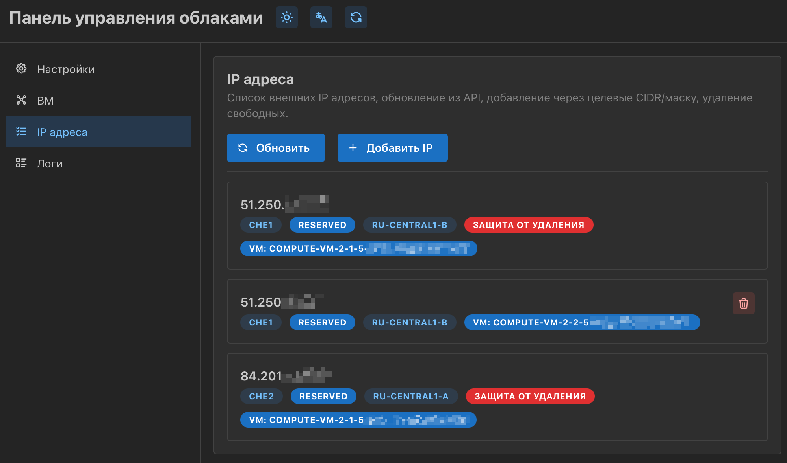
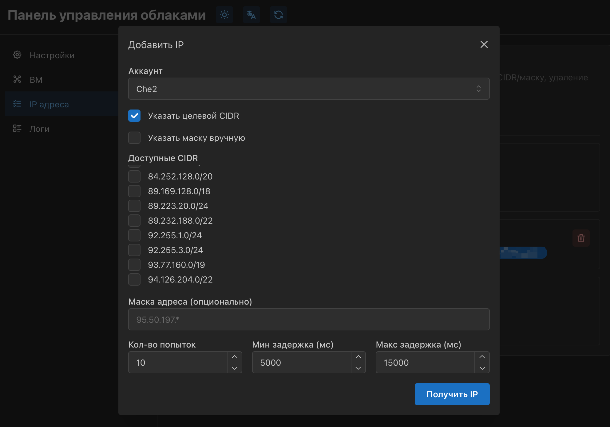

## Yandex Cloud Control Panel

Веб‑панель (Next.js) для работы с Yandex Cloud: добавление нескольких аккаунтов, управление публичными IP, валидация и мониторинг ВМ (ping/API), просмотр логов задач.

### Требования

-   Node.js 20+
-   npm 10+ (репозиторий использует `package-lock.json`)

### Установка

```bash
npm install
```

### Запуск (dev)

```bash
npm run dev:web
```

Приложение поднимется на `http://localhost:3009`.

### Сборка/прод (локально)

```bash
# установка зависимостей (один раз)
npm install

# сборка Next.js в production-режиме
NODE_ENV=production npm run build:web

# запуск собранного приложения
PORT=3009 \
SESSION_SECRET=change-me \
BASIC_AUTH_USER=admin \
BASIC_AUTH_PASS=admin \
NODE_ENV=production \
npm run start:web
```

Хранилище и логи пишутся в `data/` и `logs/` (директории должны быть доступны на запись). При необходимости можно переопределить пути через `CONFIG_PATH`/`DB_PATH`.

### Docker (GHCR)

**Вариант 1 — docker-compose + .env**

```bash
wget https://raw.githubusercontent.com/LazyGatto/ycloud-panel/main/docker-compose.yml

cat > .env <<EOF
PORT=3009
BASIC_AUTH_USER=admin
BASIC_AUTH_PASS=$(openssl rand -hex 16)
SESSION_SECRET=$(openssl rand -hex 32)
SESSION_TTL_SECONDS=86400
EOF

echo "Credentials:"
grep -E '^(BASIC_AUTH_USER|BASIC_AUTH_PASS)=' .env

docker compose up -d
```

**Вариант 2 — docker run**

```bash
BASIC_AUTH_USER=admin
BASIC_AUTH_PASS="$(openssl rand -hex 16)"
SESSION_SECRET="$(openssl rand -hex 32)"

docker pull ghcr.io/lazygatto/ycloud-panel:latest

docker run -d --name ycloud-panel \
  -p 3009:3009 \
  -e PORT=3009 \
  -e BASIC_AUTH_USER="${BASIC_AUTH_USER}" \
  -e BASIC_AUTH_PASS="${BASIC_AUTH_PASS}" \
  -e SESSION_SECRET="${SESSION_SECRET}" \
  -e SESSION_TTL_SECONDS=86400 \
  -v "$(pwd)/data:/app/data" \
  -v "$(pwd)/logs:/app/logs" \
  ghcr.io/lazygatto/ycloud-panel:latest
```

### Скриншоты






### Структура данных/конфиг

-   `data/config.json` — основной конфиг (аккаунты YC, ВМ, IP, джобы).
-   `data/authorized_key-<accountId>.json` — ключи сервисных аккаунтов сохраняются сюда при загрузке через UI.
-   `logs/` — логи задач (мониторы ВМ, IP‑операции и т.д.).

### Основные сценарии

1. **Добавить аккаунт YC** в разделе Настройки (загрузить `authorized_key.json`, указать `folderId/zoneId`). При валидации подтянутся ВМ/IP и создадутся задачи мониторинга.
2. **Получить IP** в разделе IP‑адреса (учитывается лимит per account, можно задавать CIDR/маску, есть пошаговый лог и отмена).
3. **Мониторинг ВМ** в разделе ВМ: запуск/стоп задач ping/API, обновление статуса, просмотр логов по ВМ.

### Полезные команды

-   `npm run lint` / `npm run build` — проверки TypeScript.
-   `npm run start:yandex` — запуск CLI‑скрипта из `src/yandex.ts` (для совместимости со старым флоу).

### Примечания

-   Все переменные окружения для YC (IAM/VPC/Compute endpoints) берутся из `.env` или системных, ключи сервисных аккаунтов хранятся локально в `data/`.
-   UI поддерживает RU/EN, светлую/тёмную тему и сохраняет выбранные настройки в `data/config.json`.
